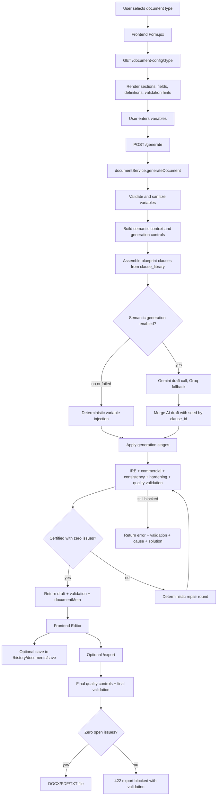
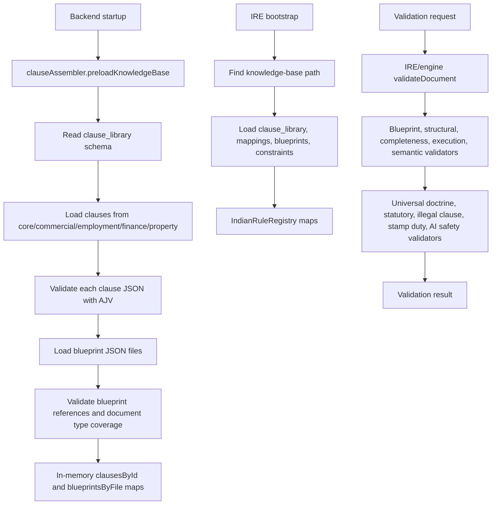
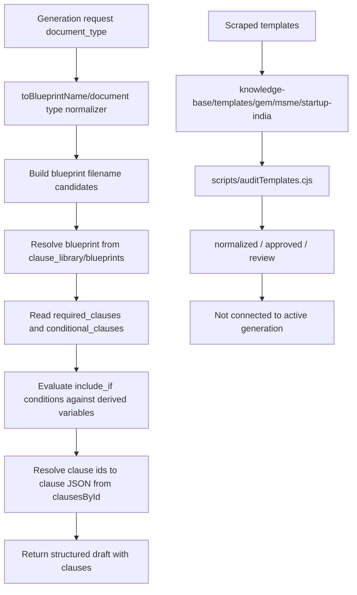

# LegalAId Technical Audit Report

Generated: 2026-06-06
Workspace: D:\dev\LegalAId

Security note: local environment files are present. This report lists environment variable names only and intentionally redacts values.

## 1. Project Structure

All major folders are accounted for below. High-volume legal data folders are summarized by count because they contain generated JSON records rather than hand-authored key files.

```text
D:\dev\LegalAId
|-- .env
|   Local environment file. Contains runtime secrets and must not be committed or shared.
|-- .gitignore
|   Git ignore rules.
|-- package.json
|   Root Node package. Provides shared dependencies used by scripts and tooling.
|-- package-lock.json
|   Root npm lockfile.
|-- README.md
|   Project documentation entrypoint.
|-- render.yaml
|   Render deployment configuration.
|-- backend/
|   Express/Mongoose API server, drafting pipeline, validation, export, AI, auth, history.
|-- frontend/
|   Vite React single-page app for login, document library, intake forms, editor, profile, documents.
|-- IRE/
|   Indian Rule Engine validation package used by backend validation.
|-- knowledge-base/
|   File-based legal knowledge base, active clause library, scraped legal records, diagnostics, raw/normalized templates.
|-- scraper/
|   Scraper package for IndiaCode, regulators, eGazette, RERA, case law, and template sources.
|-- scripts/
|   One-off and repeatable maintenance/audit scripts.
|-- shared/
|   Shared document type registry used by backend and export logic.
|-- tests/
|   Node-based tests, currently including template audit diagnostics test.
|-- tmp/
|   Temporary snapshots and working files.
|-- node_modules/
|   Installed dependencies. Should remain generated local state, not source.
```

### backend/

```text
backend
|-- index.js
|   Main Express app. Loads env, connects MongoDB, preloads clause knowledge base, registers routes, validates export.
|-- .env.example
|   Backend environment variable example.
|-- package.json / package-lock.json
|   Backend npm package and lockfile.
|-- ai/
|   LLM clients and prompt construction.
|   |-- aiClient.js
|   |   Gemini-first AI facade with Groq fallback for generation, chat, fix, safety calls.
|   |-- geminiClient.js
|   |   Google Gemini client using gemini-2.5-flash and JSON schemas.
|   |-- groqClient.js
|   |   OpenAI-compatible Groq client, default model openai/gpt-oss-20b.
|   |-- openiaiClient.js
|   |   OpenAI client exists, but is not the primary active generation path.
|   |-- promptBuilder.js
|   |   Builds semantic legal drafting prompt from variables, blueprint clauses, party guidance, and policy.
|-- auth/
|   Authentication, JWT middleware, email verification/password reset.
|   |-- authRoutes.js
|   |   Register, verify email, login, resend verification, forgot/reset password, me, change password.
|   |-- authMiddleware.js
|   |   Bearer JWT verification and verified-email enforcement.
|   |-- emailService.js
|   |   Resend/SMTP/Mailtrap email transport selection.
|-- commercial/
|   Commercial risk/protection detection and clause enhancement.
|   |-- commercialEngine.js
|   |-- injector.js
|   |-- protectionDetector.js
|   |-- protectionLibrary.js
|   |-- signalDetector.js
|-- config/
|   Document intake config, variable definitions, clause ordering.
|   |-- documentConfig.js
|   |   Supported form document types, required fields, sections, signature types.
|   |-- variableConfig.js
|   |   Field labels, types, validation rules, examples, descriptions, sanitization.
|   |-- clauseOrder.js
|   |   Clause category normalization and ordering.
|-- ire/
|   Backend adapter into IRE.
|   |-- runner.js
|   |   Converts document type and calls IRE/engine.js validateDocument().
|   |-- commercialValidator.js
|   |   Commercial validation layer.
|-- models/
|   MongoDB/Mongoose models.
|   |-- User.js
|   |-- DocumentDraft.js
|   |-- DocumentVersion.js
|-- routes/
|   Express routers beyond auth.
|   |-- documentHistoryRoutes.js
|-- services/
|   Drafting, validation, export, clause assembly, consistency, quality, formatting, intake assistant.
|   Key files:
|   |-- documentService.js
|   |   Main generation orchestration.
|   |-- clauseAssembler.js
|   |   Loads clause_library, validates JSON schema, resolves blueprints and conditional clauses.
|   |-- validationService.js
|   |   Aggregates IRE, commercial, consistency, hardening, clause quality, final quality validation.
|   |-- documentQualityControl.js
|   |   Final QA/hardening layer for placeholders, duplicates, numbering/currency/party consistency.
|   |-- documentHardening.js
|   |   Deterministic legal/document-type hardening rules.
|   |-- deterministicFixer.js
|   |   Applies deterministic repairs from validation issues.
|   |-- draftConsistencyValidator.js
|   |   Checks source form variables against final draft.
|   |-- exportService.js
|   |   DOCX/PDF/TXT export formatting.
|   |-- documentHistoryService.js
|   |   Saves latest draft per user/document type; version restore is intentionally disabled.
|   |-- documentIntakeConfig.js
|   |   Builds frontend field/section config from backend config.
|   |-- intakeAssistantService.js
|   |   Ask-AI form assistant with schema-constrained suggestions.
|   |-- variableLoader.js / variableValidator.js / variableInjector.js / draftVariableInjector.js
|   |   Variable schema loading, validation, sanitization, injection.
|   |-- inputSemantics.js / generationControls.js / draftingPolicy.js / partyNaming.js
|   |   Semantic interpretation and document-specific drafting policy.
|   |-- jurisdictionEngine.js / doctrineInjector.js / scopeGuard.js / signatureResolver.js
|   |   Deterministic legal context and signature resolution.
|-- utils/
|   Utility helpers.
|   |-- riskAggregator.js
```

### frontend/

```text
frontend
|-- package.json / package-lock.json
|   React/Vite frontend package and lockfile.
|-- vite.config.js
|   Vite config.
|-- index.html
|   Vite HTML shell.
|-- src/
|   |-- main.jsx
|   |   React app entrypoint.
|   |-- App.jsx
|   |   React Router route map.
|   |-- index.css / App.css
|   |   Global styling.
|   |-- context/AuthContext.jsx
|   |   LocalStorage token handling and current-user loading.
|   |-- services/api.js
|   |   Axios instance and API helpers.
|   |-- layout/Layout.jsx / Layout.css
|   |   Shared app layout.
|   |-- components/
|   |   Header, Footer, ProtectedRoute, RiskPanel, ClauseEditor.
|   |-- pages/
|   |   Home, Library, Form, Editor, Documents, Profile, About, Contact, Help, PrivacyPolicy, TermsOfService.
|   |-- pages/auth/
|   |   Login, Register, VerifyEmail, ResendVerification, ForgotPassword, ResetPassword, auth styling.
|   |-- utils/
|   |   validation.js, icons.jsx, download.js, documentCatalog.js.
```

### IRE/

```text
IRE
|-- package.json / package-lock.json
|   Standalone rule-engine package.
|-- engine.js
|   Main validation entrypoint used by backend.
|-- bootstrap.js
|   Loads clause library, mappings, blueprints, constraints into registry.
|-- test.integration.js
|   Integration tests for validation behavior.
|-- src/indian-rule-engine/
|   Registry, blueprint, structural, semantic, execution, completeness, jurisdiction, stamp duty, illegal clause, AI safety validators.
|-- src/universal/
|   Universal doctrine validation and fact extraction.
|-- src/universal/primitives/
|   Indian Contract Act style primitives: arbitration, capacity, consent, consideration, enforceability, indemnity, restraint of trade, termination.
|-- src/statutes/
|   Statutory loader, rule compiler, requirement extraction, statutory validation.
```

### knowledge-base/

```text
knowledge-base
|-- acts/                      10,774 files. IndiaCode act records.
|-- sections/                 104,645 files. IndiaCode section records.
|-- subordinate/               13,570 files. Subordinate legislation records.
|-- regulatory/                 4,221 files. RBI/SEBI/MCA/IRDAI/DPIIT records.
|-- gazette/                      457 files. eGazette records.
|-- rera/                      26,254 files. RERA records.
|-- case-law/                      71 files. Case law records.
|-- clause_library/               165 files. Active production clause and blueprint system.
|-- clauses/                       10 files. Extracted reusable clauses from scraped raw templates, not connected to generation.
|-- constraints/                    9 files. IRE/domain constraint rules.
|-- diagnostics/                    5 files before this report. Audit outputs.
|-- interaction_engine/              3 files. Interaction/assistant data.
|-- mappings/                      20 files. Document type to clause mappings.
|-- metadata/                      11 files. Metadata records.
|-- rules/                          5 files. Illegal clause, stamp duty, and related rules.
|-- templates/                    372 files. Raw scraped, normalized, approved/review template assets.
|-- variables/                     20 files. Variable/field knowledge.
```

### scraper/

```text
scraper
|-- package.json / package-lock.json
|   Scraper package.
|-- config/
|   Source configuration JSON for startup-india, msme, gem, rbi, sebi, mca, irdai, dpiit.
|-- src/orchestrator.js
|   Selects scraper groups from SCRAPER_TARGETS and related env flags.
|-- src/jobs/
|   Group jobs for IndiaCode, regulatory, gazette, RERA, case law, templates.
|-- src/scrapers/
|   Source-specific scraper implementations.
|-- src/parsers/
|   HTML/PDF/DOCX/text parsing helpers.
|-- src/storage/
|   File storage and backup storage. Mongo storage is a placeholder.
|-- src/postprocess/
|   Post-processing scripts.
```

### scripts/

```text
scripts
|-- auditTemplates.cjs
|   Audits scraped raw templates, extracts intelligence, normalizes, scores, routes to approved/review, extracts clauses.
|-- auditLegalKbPriorities.cjs
|   Local knowledge-base priority audit.
|-- fillClauses.js
|   AI-assisted clause filling script.
|-- generateClauses.js
|   Clause-library generation helper.
|-- mergeKnowledgeBaseV3.mjs
|   Merges/extracts V3 knowledge-base assets while preserving runtime data.
|-- normalizeClauseLibrary.js
|   Normalizes clause library and blueprint references.
```

### shared/

```text
shared
|-- documentRegistry.js
|   Shared canonical document type registry, aliases, display names, IRE type mapping, blueprint names.
```

### tests/

```text
tests
|-- auditTemplates.test.cjs
|   Runs scripts/auditTemplates.cjs and asserts diagnostics, counts, approval/review indexes, and no pipeline connection.
```

## 2. Tech Stack

### Runtime and Package Managers

- Package manager: npm.
- Backend runtime: Node.js, package declares Node >= 18.
- Module system: ES modules for root/backend/frontend/IRE/scraper packages where `type: "module"` is set. Some tests/scripts use CommonJS (`.cjs`).

### Backend

- Framework: Express.
- Database: MongoDB via Mongoose.
- Auth/security: JWT (`jsonwebtoken`), password hashing (`bcryptjs`), email verification/reset.
- AI clients: `@google/generative-ai`, `@google/genai`, OpenAI-compatible fetch for Groq, `openai` dependency present.
- Validation: AJV for JSON schema validation, custom IRE validators.
- Export: `docx`, `pdfkit`, TXT exporter.
- Email: Resend SDK/API path plus SMTP/Mailtrap fallback via `nodemailer`.
- CORS/body parsing: `cors`, Express JSON/urlencoded body parsing.
- Rate limit dependency exists (`express-rate-limit`) in root package, but no active middleware mount was found in `backend/index.js`.

### Frontend

- Framework: React 19.2.4.
- Build tool: Vite 5.1.
- Routing: React Router DOM 7.13.1.
- HTTP: Axios.
- Styling: CSS modules/files imported by components/pages.

### Scraper

- HTTP/browser: Axios, Puppeteer.
- Parsing: Cheerio, Mammoth, pdf-parse, custom text processor.
- Throttling: Bottleneck.
- Storage: file-based JSON/TXT storage with backup support.

### IRE

- Language: JavaScript ES modules.
- Validation: custom registry, blueprint, structural, completeness, execution, semantic, universal, statutory, stamp-duty, illegal-clause, AI-safety validators.
- Schema validation: AJV.

## 3. Database Architecture

Database is MongoDB through Mongoose. No SQL tables exist.

### User Collection

Model file: `backend/models/User.js`

Fields:

| Field | Type | Required | Notes |
|---|---|---:|---|
| name | String | yes | trim, maxlength 100 |
| email | String | yes | unique, lowercase, trim, email regex |
| phone | String | no | trim, Indian 10-digit mobile regex |
| password | String | yes | minlength 8, `select: false`, hashed with bcrypt cost 12 before save |
| isVerified | Boolean | no | default false |
| verificationToken | String | no | `select: false` |
| verificationTokenExpiry | Date | no | `select: false` |
| resetPasswordToken | String | no | `select: false` |
| resetPasswordExpiry | Date | no | `select: false` |
| createdAt | Date | auto | timestamps |
| updatedAt | Date | auto | timestamps |

Indexes:

- `email` unique index from schema property.

Relationships:

- Referenced by `DocumentDraft.userId` and `DocumentVersion.userId`.

Methods/hooks:

- `pre("save")` hashes password when modified.
- `comparePassword(candidate)` checks bcrypt password.

Roles:

- No role field exists. Authorization is binary: authenticated + verified email.

### DocumentDraft Collection

Model file: `backend/models/DocumentDraft.js`

Fields:

| Field | Type | Required | Notes |
|---|---|---:|---|
| userId | ObjectId ref User | yes | indexed |
| documentType | String | yes | indexed |
| title | String | yes | trim, maxlength 200 |
| documentMeta | Mixed | no | default null |
| currentDraft | Mixed | yes | latest draft JSON |
| currentValidation | Mixed | no | latest validation JSON |
| sourceVariables | Mixed | no | sanitized source form variables |
| currentVersionNumber | Number | no | default 1, min 1 |
| versionCount | Number | no | default 1, min 1 |
| latestVersionId | ObjectId ref DocumentVersion | no | default null |
| lastContentHash | String | yes | sha256-style hash stored by service |
| status | String enum | no | draft, validated, exported, archived; default draft; indexed |
| lastOpenedAt | Date | no | default null |
| lastValidatedAt | Date | no | default null |
| lastExportedAt | Date | no | default null |
| createdAt | Date | auto | timestamps |
| updatedAt | Date | auto | timestamps |

Indexes:

- `userId`
- `documentType`
- `status`
- compound `{ userId: 1, updatedAt: -1 }`

Relationships:

- Belongs to one `User`.
- Can reference `DocumentVersion`, but current service does not create versions.

Important behavior:

- `documentHistoryService.saveDocumentHistory()` keeps only one latest record per user/document type.
- Legacy duplicate records and versions are purged by document type.

### DocumentVersion Collection

Model file: `backend/models/DocumentVersion.js`

Fields:

| Field | Type | Required | Notes |
|---|---|---:|---|
| draftId | ObjectId ref DocumentDraft | yes | indexed |
| userId | ObjectId ref User | yes | indexed |
| versionNumber | Number | yes | min 1 |
| changeType | String enum | yes | generated, autosave, manual_edit, ai_edit, validated, exported, restored |
| contentHash | String | yes | trim |
| draftSnapshot | Mixed | yes | snapshot body |
| validationSnapshot | Mixed | no | default null |
| summary | Mixed | no | default null |
| createdAt | Date | auto | timestamps createdAt only |

Indexes:

- `draftId`
- `userId`
- unique compound `{ draftId: 1, versionNumber: -1 }`
- compound `{ userId: 1, createdAt: -1 }`

Important behavior:

- The model exists, but version storage is currently disabled in the service.
- `restoreDocumentHistoryVersion()` always throws 410: "Version history is no longer stored. Only the latest saved draft is kept for each document type."

## 4. API Layer

Base URL default on frontend: `http://localhost:5000`, override with `VITE_API_BASE_URL`.

### Public Backend Routes

| Method | Path | Purpose | Request Shape | Response Shape |
|---|---|---|---|---|
| GET | `/health` | Backend liveness. | none | `{ status, version }` |
| GET | `/document-types` | List configured document types for home/library. | none | `{ types: [{ type, displayName, family, ireType, blueprintName, signatureType, requiredFields }] }` |
| GET | `/document-config/:type` | Return form field/section config for document type. | path `type` | config object with document meta, fields, sections, signatureType; 404 `{ error }` if unknown |

### Auth Routes

Mounted at `/auth`.

| Method | Path | Auth | Purpose | Request Shape | Response Shape |
|---|---|---|---|---|---|
| POST | `/auth/register` | public | Create unverified user and send verification email. | `{ name, email, phone?, password }` | 201 `{ message }`; errors `{ error, unverified? }` |
| GET | `/auth/verify-email?token=` | public | Verify email and issue JWT. | query `token` | `{ message, token, user }`; expired `{ error, expired: true }` |
| POST | `/auth/login` | public | Login verified user. | `{ email, password }` | `{ token, user }`; 403 if unverified |
| POST | `/auth/resend-verification` | public | Send new verification token. | `{ email }` | `{ message }` |
| POST | `/auth/forgot-password` | public | Send reset token if verified account exists. | `{ email }` | generic `{ message }` to prevent enumeration |
| POST | `/auth/reset-password` | public | Reset password using token. | `{ token, password }` | `{ message }`; expired `{ error, expired: true }` |
| GET | `/auth/me` | Bearer JWT | Return current user. | auth header | `{ user }` |
| POST | `/auth/change-password` | Bearer JWT | Change password. | `{ currentPassword, newPassword }` | `{ message }` |

Serialized user:

```json
{
  "id": "mongo id",
  "name": "string",
  "email": "string",
  "phone": "string or undefined",
  "createdAt": "date"
}
```

### Protected Drafting Routes

All require `Authorization: Bearer <jwt>` and verified email.

| Method | Path | Purpose | Request Shape | Response Shape |
|---|---|---|---|---|
| GET | `/variables/:documentType` | Load variable schema. | path `documentType` | variable schema JSON; 500 `{ error }` |
| POST | `/generate` | Generate draft from form input. | `{ document_type, variables, jurisdiction?, semantic_generation?, generation_style? }` | success `{ draft, validation, documentMeta }`; failure `{ error, validation?, issue }` |
| POST | `/intake-assistant` | Ask AI for form-field help. | `{ document_type, variables?, message }` | `{ reply, suggested_updates: [{ field, value, reason }] }` |
| POST | `/validate` | Validate draft. | draft-like body with `{ document_type, clauses, variables?, mode? }` | `{ validation }` |
| POST | `/export` | Export only if final validation has zero open issues. | `{ draft, variables?, format }` where format is docx/pdf/txt | file response; 422 `{ error, validation }` if blocked |
| POST | `/chat` | Ask AI about a draft or request edits. | `{ draft, message }` | `{ type: "reply"|"edit", reply, edits }` |
| POST | `/fix-issue` | AI repair for a validation issue. | `{ draft, issue }` | `{ fixed, draft?, validation?, explanation?, edits? }` or 422 result |
| GET | `/admin/models` | Gemini model diagnostic. | auth only | model list from Gemini client |

Generation error issue object:

```json
{
  "category": "VALIDATION_BLOCKED | AI_RATE_LIMITED | AI_PROVIDER_UNAVAILABLE | INPUT_ERROR | GENERATION_FAILED",
  "cause": "human-readable cause",
  "solution": "human-readable next action"
}
```

### History Routes

Mounted at `/history`, protected by `protect`.

| Method | Path | Purpose | Request Shape | Response Shape |
|---|---|---|---|---|
| GET | `/history/documents` | List latest non-archived drafts per document type. | none | `{ documents: [historySummary] }` |
| POST | `/history/documents/save` | Save latest draft. | `{ draftId?, draft, validation?, documentMeta?, changeType? }` | `{ history, versionCreated: false, latestVersion: null }` |
| GET | `/history/documents/:id` | Load draft detail. | path `id` | `{ draft, validation, documentMeta, history, versions: [] }` |
| DELETE | `/history/documents/:id` | Delete all records for that user's document type. | path `id` | `{ deleted, draftId, documentType }` |
| POST | `/history/documents/:id/restore/:versionId` | Restore old version. | path `id`, `versionId` | Currently 410 `{ error }` because version history is disabled |

### Frontend API Helpers

File: `frontend/src/services/api.js`

- Axios instance adds `Authorization: Bearer <token>` from `localStorage.legalaid_token`.
- 401 responses redirect to `/login` unless `skipAuthRedirect`.
- Helpers mirror backend routes: `getDocumentTypes`, `getDocumentConfig`, `generateDocument`, `chatWithIntakeAssistant`, history helpers, `validateDocument`, `chatWithDocument`, `fixIssue`, auth helpers, and `downloadDocument`.

## 5. Document Generation Pipeline

### Frontend User Flow

1. User opens document library/form.
2. `frontend/src/pages/Form.jsx` receives or resolves a document type.
3. Form loads backend config through `getDocumentConfig(type)` from `frontend/src/services/api.js`.
4. Form renders fields from backend sections/fields.
5. Each field displays an input definition. If backend config has `description`, it is shown; otherwise `buildFieldDefinitionText()` generates a practical explanation.
6. User may ask the intake assistant through `chatWithIntakeAssistant({ document_type, variables, message })`.
7. On submit, frontend calls `generateDocument(data)`, where data includes `document_type` and `variables`.
8. On backend/frontend/AI/validation error, `Form.jsx` uses `buildGenerationIssue()` to show:
   - user-facing title,
   - message,
   - cause,
   - solution,
   - optional technical detail,
   - validation-derived field links where available.
9. On success, frontend navigates to `Editor` with `draft`, `validation`, and `documentMeta`.

### Backend Generation Call Graph

Entrypoint: `POST /generate` in `backend/index.js`.

High-level call sequence:

```text
/generate
-> generateDocument(req.body)
   -> loadIREModules()
   -> validateInputByDocumentType(input)
      -> loadVariables(input.document_type)
      -> sanitizeVariablesForDocument(document_type, variables)
      -> validateVariables(schema, sanitizedVariables)
   -> prepareGenerationInput(input)
      -> sanitizeVariablesForDocument()
      -> deriveGenerationControls()
      -> buildSemanticContext()
   -> if semantic_generation enabled:
      -> createBlueprintDraft()
         -> assembleDocument(document_type, variables)
      -> applyGenerationStages(seedDraft)
      -> attemptSemanticDraft()
         -> callAI()
            -> buildPrompt()
            -> callGemini()
            -> optional callGroq() fallback
         -> mergeAIDraftWithSeed()
      -> attachDraftContext()
      -> runGenerationStageValidation()
      -> optional applyDeterministicRepairRound()
   -> deterministic fallback:
      -> createDeterministicBaseDraft()
         -> assembleDocument()
         -> injectDraftVariables()
      -> applyGenerationStages()
      -> attachDraftContext()
      -> runGenerationStageValidation()
      -> optional applyDeterministicRepairRound()
   -> return { draft, validation } or blocked error
```

### applyGenerationStages()

File: `backend/services/documentService.js`

Applied in order:

```text
resolveDependencies()
-> injectJurisdictionRules()
-> injectDoctrine()
-> enforceScopeGuard()
-> resolveSignatures()
-> applyDocumentHardening()
-> applyDocumentQualityControls()
-> enhanceCommercially()
-> lockCriticalClauses()
-> CategoryMapper.mapAndNormalize()
-> normalizeClauseText()
-> applyDocumentQualityControls()
```

This means quality controls are applied twice: once before commercial/locking/category normalization and once at the end.

### Draft Validation Call Graph

Entrypoint: `runDocumentValidation()` in `backend/services/validationService.js`.

```text
runDocumentValidation(draft, options)
-> IRE validate()
   -> backend/ire/runner.js
      -> IRE/engine.js validateDocument()
         -> blueprint validation
         -> structural validation
         -> completeness validation
         -> execution validation
         -> semantic validation
         -> universal doctrine validation
         -> statutory validation
         -> illegal clause validation
         -> stamp duty validation
         -> AI legal safety validation
-> commercialValidate()
-> validateDraftConsistency()
-> validateDocumentHardening()
-> validateClauseQuality()
-> validateDocumentQuality()
-> formatValidationResult()
   -> deduplicate issues
   -> collapse noisy clause issues
   -> split blocking/advisory/notices
   -> calculate risk/certification summary
```

Validation modes:

- `background`: lighter validation.
- `generation`: generation-stage validation, includes universal validation.
- `final`: export-grade validation, includes statutory, stamp duty, AI safety.

### Export Pipeline

Entrypoint: `POST /export` in `backend/index.js`.

```text
/export
-> normalizeExportFormat(format)
-> applyDocumentQualityControls(draft, variables)
-> runDocumentValidation(exportDraft, mode="final")
-> block unless certified true, risk not BLOCKED, zero open issues
-> draftToText() OR draftToPdf() OR draftToDocx()
-> send file response with Content-Disposition
```

Export service:

- File: `backend/services/exportService.js`
- Supported formats: `docx`, `pdf`, `txt`.
- DOCX uses `docx` package with Times New Roman, legal paragraph styles, title/body/recital/heading/item/signature styles.
- PDF uses `pdfkit`.
- Clauses are sorted through `sortClausesByOrder()` and split into identity, body, schedule, signature groups.

## 6. Template System

There are two separate template systems:

1. Active production drafting system: clause-library blueprints plus clause JSON files.
2. Scraped raw template corpus: isolated under `knowledge-base/templates`, audited and cleaned, not connected to generation.

### Active Production Template/Blueprint System

Storage:

```text
knowledge-base/clause_library/
|-- base_clause.schema.json
|-- blueprints/
|-- core/
|-- commercial/
|-- employment/
|-- finance/
|-- property/
```

Counts:

- 165 JSON files total under `knowledge-base/clause_library`.
- 23 blueprint JSON files under `knowledge-base/clause_library/blueprints`.
- Clause folders: `commercial`, `core`, `employment`, `finance`, `property`.

Blueprint files include:

- `nda.blueprint.json`
- `employment.blueprint.json`
- `employment_contract.blueprint.json`
- `service.blueprint.json`
- `consultancy_agreement.blueprint.json`
- `partnership_deed.blueprint.json`
- `shareholders_agreement.blueprint.json`
- `joint_venture_agreement.blueprint.json`
- `supply_agreement.blueprint.json`
- `distribution_agreement.blueprint.json`
- `sales_of_goods_agreement.blueprint.json`
- `independent_contractor_agreement.blueprint.json`
- `commercial_lease_agreement.blueprint.json`
- `leave_and_license_agreement.blueprint.json`
- `loan.blueprint.json`
- `guarantee.blueprint.json`
- `technology.blueprint.json`
- plus `contractor`, `ip`, `mou`, `privacy`, `rental`, and typo-named `vendor.bluepeint.json`.

Selection logic:

- `backend/services/clauseAssembler.js` preloads the library at backend startup.
- `preloadKnowledgeBase({ documentTypes: Object.keys(DOCUMENT_CONFIG) })` validates that every configured document type has a blueprint.
- `toBlueprintName()` from shared registry/document normalizer creates blueprint candidates.
- Candidate filenames include canonical blueprint name, lowercase document type, and aliases after stripping `_agreement`, `_contract`, `_deed`.
- If no blueprint is found, generation throws an explicit error.

Clause resolution:

- Blueprint required clauses come from `required_clauses` or `clauses`.
- Conditional clauses come from `conditional_clauses`.
- Conditions support:
  - `field == value`
  - `field != value`
  - boolean/affirmative field name checks.
- Variables are first normalized through `deriveGenerationControls()`.
- Resolved clause ids are de-duplicated while preserving order.

Variable resolution:

- Form fields come from `backend/config/documentConfig.js` and `backend/config/variableConfig.js`.
- `loadVariables(documentType)` loads the schema.
- `sanitizeVariablesForDocument()` removes/normalizes values not valid for the document.
- `validateVariables()` blocks missing required fields, invalid formats, entity-specific missing fields, and unsafe placeholders.
- Draft placeholders are injected by `draftVariableInjector.js`/`variableInjector.js`; unresolved variable warnings are logged.

Supported configured document types:

- `NDA`
- `EMPLOYMENT_CONTRACT`
- `SERVICE_AGREEMENT`
- `CONSULTANCY_AGREEMENT`
- `PARTNERSHIP_DEED`
- `SHAREHOLDERS_AGREEMENT`
- `JOINT_VENTURE_AGREEMENT`
- `SUPPLY_AGREEMENT`
- `DISTRIBUTION_AGREEMENT`
- `SALES_OF_GOODS_AGREEMENT`
- `INDEPENDENT_CONTRACTOR_AGREEMENT`
- `COMMERCIAL_LEASE_AGREEMENT`
- `LEAVE_AND_LICENSE_AGREEMENT`
- `LOAN_AGREEMENT`
- `GUARANTEE_AGREEMENT`
- `SOFTWARE_DEVELOPMENT_AGREEMENT`
- `MOU`

Shared registry additionally contains `PRIVACY_POLICY` and `RENTAL_AGREEMENT`, but they are not currently in backend `DOCUMENT_CONFIG`.

### Scraped Raw Template Corpus

Storage:

```text
knowledge-base/templates/
|-- gem/
|-- msme/
|-- startup-india/
|-- normalized/
|-- approved/
|-- review/
```

Current audit policy:

- Raw scraped templates are treated as raw input.
- No scraping was performed during audit.
- Approved/review outputs are not connected to generation.

Latest audit summary from `knowledge-base/diagnostics/template_audit.json`:

| Metric | Count |
|---|---:|
| total_templates | 224 |
| valid_templates | 73 |
| duplicates | 0 |
| broken | 62 |
| empty | 62 |
| incomplete | 176 |
| misclassified | 27 |
| unresolved_placeholders | 57 |
| raw_documents | 130 |
| inconsistent_formatting | 152 |

By source:

| Source | Total | Valid | Raw Docs | Broken | Empty | Incomplete | Misclassified | Unresolved Placeholders |
|---|---:|---:|---:|---:|---:|---:|---:|---:|
| gem | 31 | 21 | 28 | 0 | 0 | 24 | 0 | 8 |
| msme | 83 | 15 | 25 | 32 | 32 | 67 | 27 | 10 |
| startup-india | 110 | 37 | 77 | 30 | 30 | 85 | 0 | 39 |

Latest quality summary from `knowledge-base/diagnostics/template_quality_report.json`:

- Normalized templates: 73.
- Approved templates: 14 templates plus index file.
- Review templates: 59 templates plus index file.
- Extracted reusable clauses: 9.
- Average quality score: 72.
- Approval threshold: 80.

Generated files:

- `knowledge-base/diagnostics/template_audit.json`
- `knowledge-base/diagnostics/template_intelligence_report.json`
- `knowledge-base/diagnostics/template_quality_report.json`
- `knowledge-base/templates/normalized/`
- `knowledge-base/templates/approved/`
- `knowledge-base/templates/review/`
- `knowledge-base/clauses/`

## 7. Clause System

### Production Clause Library

Schema file: `knowledge-base/clause_library/base_clause.schema.json`

Required production clause fields:

| Field | Type | Notes |
|---|---|---|
| clause_id | string | unique clause identifier |
| name | string | human name |
| category | string | normalized later by backend |
| document_types | array string | compatible document types |
| jurisdiction | string | usually India |
| text | string | clause body |
| legal_basis | array object | act plus section or article |
| mandatory | boolean | mandatory flag |
| enforceability | enum | HIGH, MEDIUM, LOW |
| risk_level | enum | LOW, MEDIUM, HIGH |
| invalid_if | array string | invalidity conditions |
| source | string | source metadata |
| version | string | version metadata |

Loader/connection:

- `backend/services/clauseAssembler.js` loads and schema-validates every JSON clause except blueprints.
- Duplicate `clause_id` fails startup.
- Empty clause text fails startup.
- Missing blueprint references fail startup.
- Missing blueprint coverage for any `DOCUMENT_CONFIG` type fails startup.
- `IRE/bootstrap.js` also loads the same clause library, mappings, blueprints, and constraints into the IRE registry.

Clause ordering:

- `backend/config/clauseOrder.js` normalizes categories and sorts clauses for validation/export.
- `exportService.js` separates identity, body, schedule, and signature clauses.

Clause quality:

- `clauseQualityNormalizer.js` normalizes clause text and validates clause text quality.
- `documentQualityControl.js` detects unresolved placeholders, duplicate clauses/definitions, numbering/currency/party issues, and unsafe internal markers.
- `clauseLocker.js` protects critical clauses from unsafe modification.

### Extracted Clause Library from Scraped Templates

Storage: `knowledge-base/clauses/`

Files:

- `arbitration.json`
- `confidentiality.json`
- `force_majeure.json`
- `indemnity.json`
- `ip_ownership.json`
- `jurisdiction.json`
- `notice_period.json`
- `payment_terms.json`
- `termination.json`
- `index.json`

Schema used by extraction:

```json
{
  "clause_name": "string",
  "category": "string",
  "text": "string",
  "optional": "boolean",
  "risk_level": "string"
}
```

Status:

- This extracted clause set is diagnostics/cleanup output.
- It is not connected to the active generation pipeline.

## 8. Knowledge Base

LegalAId uses a file-based knowledge base under `knowledge-base/`.

### Active Runtime Data

- `clause_library/`: active generation clauses and blueprints.
- `constraints/`: domain constraints loaded by IRE.
- `mappings/`: document type to clause ids; loaded by IRE, with blueprints able to override mappings.
- `rules/`: illegal clause, stamp duty, and other rule files.
- `variables/`: variable knowledge, parallel to backend config.

### Scraped/Reference Data

- `acts/`: IndiaCode act metadata.
- `sections/`: IndiaCode section records.
- `subordinate/`: subordinate legislation.
- `regulatory/`: RBI, SEBI, MCA, IRDAI, DPIIT.
- `gazette/`: eGazette.
- `rera/`: RERA records.
- `case-law/`: case law records.

### Template Data

- `templates/gem`, `templates/msme`, `templates/startup-india`: raw scraped source records.
- `templates/normalized`: structured normalized template assets.
- `templates/approved`: isolated high-scoring assets, not wired to generation.
- `templates/review`: isolated lower-scoring assets for manual review.

### Query/Indexing Behavior

- No database-backed knowledge-base index was found for generation.
- Runtime loading is file-system based:
  - backend clause assembler reads JSON files into in-memory Maps at startup,
  - IRE bootstrap reads JSON files into an in-memory registry,
  - scrapers write file records and indexes directly under `knowledge-base`.
- The large scraped datasets are not directly queried by the active draft generator, except where IRE/statutory validation loads rule/statutory contexts.

## 9. AI/LLM Integration

### Active Providers

Primary generation/chat/fix provider:

- File: `backend/ai/geminiClient.js`
- Model: `gemini-2.5-flash`
- Timeout: 90 seconds.
- Temperature: 0.15.
- Response mode: JSON (`responseMimeType: "application/json"`).
- Max output tokens: 8192.

Fallback provider:

- File: `backend/ai/groqClient.js`
- Base URL: `GROQ_BASE_URL` or `https://api.groq.com/openai/v1`.
- Model: `GROQ_MODEL` or `openai/gpt-oss-20b`.
- Timeout: 60 seconds.
- Used when Gemini returns `RATE_LIMITED`, `TIMEOUT`, `AI_PROVIDER_ERROR`, or `NO_MODEL_AVAILABLE`, and `GROQ_API_KEY` exists.

OpenAI:

- `openai` dependency and `backend/ai/openiaiClient.js` exist.
- The active `aiClient.js` generation/chat/fix/safety facade traced in this audit is Gemini-first with Groq fallback.

### AI Call Sites

| Stage | File | Function | Purpose |
|---|---|---|---|
| Semantic draft generation | `backend/services/documentService.js` | `attemptSemanticDraft()` -> `callAI()` | Rewrite seed blueprint draft into fuller legal drafting while preserving clause ids |
| Intake assistant | `backend/services/intakeAssistantService.js` | `callAISafetyRaw()` | Explain form fields and propose allowed field updates |
| Editor chat | `backend/index.js` | `/chat` -> `callAIChat()` | Reply to document questions or suggest clause edits |
| Issue repair | `backend/index.js` | `/fix-issue` -> `repairDocumentIssue()` -> AI fix | Repair a validation issue |
| AI safety validation | `IRE/engine.js` | `aiLegalSafetyValidate()` | Deep/final validation of AI-touched or edited draft |

### Generation Prompt

File: `backend/ai/promptBuilder.js`

Prompt includes:

- Senior Indian transactional lawyer role.
- Raw user variables.
- Interpreted semantic facts.
- Field-by-field legal meaning.
- Clause blueprint with exact clause ids/categories.
- Party naming guidance.
- Regeneration/repair targets when provided.
- Non-negotiable rules:
  - preserve clause ids/categories,
  - keep document type,
  - use India governing law,
  - no unresolved placeholders/template syntax,
  - do not invent parties/dates/money/cities/obligations,
  - keep draft internally consistent,
  - reflect commercial/legal inputs in the correct clauses.

### Chat/Fix Prompting

- Chat prompt identifies as LegalAId AI assistant and refuses to reveal provider/vendor/model/backend details.
- Chat response schema: `{ type, reply, edits }`.
- Fix response schema: `{ explanation, edits }`.
- Suggested edits must target exact `clause_id`.

## 10. Scraper Infrastructure

Package: `scraper/`

### Orchestration

File: `scraper/src/orchestrator.js`

Groups:

- `india-code`
- `regulatory`
- `gazette`
- `case-law`
- `rera`
- `templates`

Target aliases:

- IndiaCode: `central-acts`, `state-acts`, `subordinate`.
- Regulatory: `rbi`, `sebi`, `irdai`, `mca`, `dpiit`.
- Gazette: `egazette-index`, `egazette-notifications`, `egazette-recent`, `egazette-pdf`.
- Case law: `indiankanoon`, `judis`.
- RERA: `maharera`, `delhi-rera`, `karnataka-rera`.
- Templates: `gem`, `msme`, `startup-india`.

Default behavior:

- If no `SCRAPER_TARGETS` is set, it runs central IndiaCode acts only.
- `SCRAPER_TARGETS=all` runs essential groups: IndiaCode, regulatory, gazette, templates.
- Bulk groups case law and RERA require `SCRAPER_INCLUDE_BULK_REFERENCE`.
- Subordinate legislation requires `SCRAPER_INCLUDE_SUBORDINATE`.

### Storage

File storage:

- `scraper/src/storage/fileStorage.js`
- Writes JSON/text under `knowledge-base/`.
- Skips unchanged writes.
- Backs up overwritten files unless disabled by `SCRAPER_BACKUP_MODE=none`.

Mongo storage:

- `scraper/src/storage/mongoStorage.js`
- Placeholder only: logs "MongoDB storage not implemented. Using fileStorage for now." and returns false.

### Template Sources

Template job file: `scraper/src/jobs/templateJob.js`

Sources:

- Startup India:
  - URL: `https://www.startupindia.gov.in/content/sih/en/reources/templates.html`
  - Output path: `knowledge-base/templates/startup-india/items`
- MSME:
  - `https://msme.gov.in/acts-and-rules/circular-orders/archive-circular-orders`
  - `https://my.msme.gov.in/mymsme/Scheme.aspx`
  - `https://msme.gov.in/e-book-schemes-msme`
  - `https://msme.gov.in/knowledge/operational-guideline-all-schemes-ministry-msme`
  - Output path: `knowledge-base/templates/msme/items`
- GeM:
  - `https://gem.gov.in/support/sellers/?lang=english`
  - `https://gem.gov.in/terms-of-use`
  - `https://gem.gov.in/support/terms_conditions`
  - `https://assets-bg.gem.gov.in/resources/upload/shared_doc/gtc/general-te-1675401798.pdf`
  - Output path: `knowledge-base/templates/gem/items`

### Other Scraper Targets

- IndiaCode acts/sections/subordinate legislation.
- eGazette recent uploads, notification index, PDF extraction.
- Regulatory:
  - RBI
  - SEBI
  - MCA
  - IRDAI
  - DPIIT
- RERA:
  - MahaRERA
  - Karnataka RERA
  - Delhi RERA
- Case law:
  - Indian Kanoon
  - Judis

### Parser Infrastructure

- `htmlParser.js`: Cheerio-based HTML extraction.
- `pdfParser.js`: PDF text extraction.
- `docxParser.js`: DOCX text extraction via Mammoth.
- `textProcessor.js`: text cleanup and section splitting.

## 11. Authentication and User Model

### Session Model

- JWT bearer token stored in frontend `localStorage` key `legalaid_token`.
- Frontend `AuthContext` reads token at startup and calls `/auth/me`.
- Axios interceptor attaches `Authorization: Bearer <token>`.
- On 401, frontend removes token and redirects to `/login` unless `skipAuthRedirect`.

### Backend Auth Middleware

File: `backend/auth/authMiddleware.js`

Checks:

1. Authorization header exists and starts with `Bearer `.
2. JWT verifies with `JWT_SECRET`.
3. User exists.
4. User `isVerified` is true.

Request receives:

```js
req.user = {
  _id,
  name,
  email,
  phone,
  isVerified,
  createdAt
}
```

### Roles

- No role or permissions model is implemented.
- `/admin/models` is protected by login/verified email only, not by admin role.

## 12. Key Configuration Files and Environment Variables

### Configuration Files

Root:

- `.env`: local env file with secrets. Values redacted.
- `.gitignore`: ignore rules.
- `package.json`: root package dependencies.
- `package-lock.json`: root npm lockfile.
- `render.yaml`: deployment config.

Backend:

- `backend/.env.example`: backend env documentation.
- `backend/package.json`: backend runtime dependencies and scripts.
- `backend/config/documentConfig.js`: configured document types, sections, required fields, signature types.
- `backend/config/variableConfig.js`: field definitions, validations, examples, descriptions, sanitization.
- `backend/config/clauseOrder.js`: clause category ordering and normalization.

Frontend:

- `frontend/package.json`: frontend dependencies/scripts.
- `frontend/vite.config.js`: Vite build config.

IRE:

- `IRE/package.json`: IRE package.

Scraper:

- `scraper/package.json`: scraper dependencies/scripts.
- `scraper/config/*.sources.json`: scraper source URLs and modes.

Knowledge base:

- `knowledge-base/clause_library/base_clause.schema.json`: clause schema.
- `knowledge-base/clause_library/blueprints/*.json`: blueprint config.
- `knowledge-base/constraints/*.json`: validation constraints.
- `knowledge-base/mappings/*.json`: mapping config.
- `knowledge-base/rules/*.json`: validation rules.

### Environment Variable Names

Backend/general:

- `CLIENT_URL`
- `EMAIL_FROM`
- `GEMINI_API_KEY`
- `GEMINI_WARMUP_ON_STARTUP`
- `GROQ_API_KEY`
- `GROQ_BASE_URL`
- `GROQ_MODEL`
- `JWT_EXPIRES_IN`
- `JWT_SECRET`
- `MAILTRAP_HOST`
- `MAILTRAP_PASS`
- `MAILTRAP_PORT`
- `MAILTRAP_USER`
- `MONGODB_URI`
- `OPENAI_API_KEY`
- `PORT`
- `REQUEST_BODY_LIMIT`
- `RESEND_API_KEY`
- `SMTP_HOST`
- `SMTP_PASS`
- `SMTP_PORT`
- `SMTP_USER`

Frontend:

- `VITE_API_BASE_URL`

Scraper:

- `SCRAPER_BACKUP_MODE`
- `SCRAPER_BACKUP_ROOT`
- `SCRAPER_BINARY_REQUEST_CONCURRENCY`
- `SCRAPER_BINARY_REQUEST_MIN_TIME_MS`
- `SCRAPER_BINARY_REQUEST_RETRIES`
- `SCRAPER_BINARY_TIMEOUT_MS`
- `SCRAPER_CONCURRENCY`
- `SCRAPER_CREATE_SNAPSHOT`
- `SCRAPER_DELHI_RERA_MAX_PAGES`
- `SCRAPER_DPIIT_FETCH_PDF`
- `SCRAPER_DPIIT_MAX_PAGES`
- `SCRAPER_DPIIT_PAGE_SIZE`
- `SCRAPER_DPIIT_SOURCES`
- `SCRAPER_EGAZETTE_PUPPETEER`
- `SCRAPER_EGAZETTE_RECENT_CATEGORIES`
- `SCRAPER_EGAZETTE_RECENT_DELAY_MS`
- `SCRAPER_EGAZETTE_RECENT_MAX_PAGES`
- `SCRAPER_GEM_FETCH_TEXT`
- `SCRAPER_HTML_REQUEST_CONCURRENCY`
- `SCRAPER_HTML_REQUEST_MIN_TIME_MS`
- `SCRAPER_HTML_REQUEST_RETRIES`
- `SCRAPER_HTML_TIMEOUT_MS`
- `SCRAPER_INCLUDE_BULK_REFERENCE`
- `SCRAPER_INCLUDE_SUBORDINATE`
- `SCRAPER_INDIANKANOON_FETCH_TEXT`
- `SCRAPER_INDIANKANOON_MAX_PAGES`
- `SCRAPER_INDIANKANOON_QUERY`
- `SCRAPER_IRDAI_FETCH_PDF`
- `SCRAPER_MAHARERA_MAX_PAGES`
- `SCRAPER_MAHARERA_START_PAGE`
- `SCRAPER_MAX_PAGES`
- `SCRAPER_MCA_FETCH_PDF`
- `SCRAPER_MCA_PUPPETEER`
- `SCRAPER_MSME_FETCH_PDF`
- `SCRAPER_POLITE_DELAY_MS`
- `SCRAPER_RBI_FETCH_PDF`
- `SCRAPER_RBI_PUPPETEER`
- `SCRAPER_RBI_SEEDS`
- `SCRAPER_RECOVER_FAILED_SUBORDINATE`
- `SCRAPER_REQUEST_CONCURRENCY`
- `SCRAPER_REQUEST_MIN_TIME_MS`
- `SCRAPER_REQUEST_RETRIES`
- `SCRAPER_REQUEST_TIMEOUT_MS`
- `SCRAPER_RPP`
- `SCRAPER_SEBI_FETCH_PDF`
- `SCRAPER_SEBI_MAX_PAGES`
- `SCRAPER_SEBI_START_PAGE`
- `SCRAPER_SNAPSHOT_ROOT`
- `SCRAPER_STARTUP_INDIA_FETCH_TEXT`
- `SCRAPER_STATE_DELAY_MS`
- `SCRAPER_STATE_LABELS`
- `SCRAPER_STATE_MAX_PAGES`
- `SCRAPER_STATE_MAX_STATES`
- `SCRAPER_STATE_RPP`
- `SCRAPER_SUBORDINATE_CONCURRENCY`
- `SCRAPER_TARGETS`
- `SCRAPER_TEMPLATE_FETCH_TEXT`

## 13. Known Issues or Incomplete Systems

1. Local `.env` exists with live secrets. Values are not included here. Ensure it is ignored by git and rotate any secrets that were ever exposed.

2. Scraper Mongo storage is not implemented. `scraper/src/storage/mongoStorage.js` only warns and returns false.

3. Document version history is disabled. `DocumentVersion` model exists, but `documentHistoryService` stores only latest draft and `restoreDocumentHistoryVersion()` returns 410.

4. No role-based authorization exists. `/admin/models` is accessible to any authenticated verified user.

5. Rate-limit package exists, but no active Express rate limiter was found in `backend/index.js`.

6. Encoding artifacts appear in several files/log strings/comments, such as mojibake around box drawing, emoji, arrows, and copyright symbols.

7. Shared registry and backend config are not identical. `shared/documentRegistry.js` includes `PRIVACY_POLICY` and `RENTAL_AGREEMENT`, while backend `DOCUMENT_CONFIG` currently exposes 17 types and excludes those two.

8. Blueprint file typo: `knowledge-base/clause_library/blueprints/vendor.bluepeint.json` appears misspelled. It still loads as JSON but will not be found by normal `vendor.blueprint.json` naming candidates.

9. Scraped approved templates are heuristic approval candidates, not legal-reviewed assets. They are correctly disconnected from the generation pipeline.

10. Large knowledge-base folders make broad recursive scans slow. There is no dedicated search index layer for KB querying.

11. OpenAI client/dependency exists, but active generation/chat/fix is Gemini-first with Groq fallback. This may confuse future maintainers unless documented.

12. `IRE/src/indian-rule-engine/registry.js` contains a TODO/commented incomplete standalone validate path after the registry class. Backend uses `IRE/engine.js`, so this appears stale or unused.

13. Root/backend/frontend/scraper package boundaries overlap dependencies. Root package includes server/AI/scraper dependencies while backend and scraper also have their own package files.

14. Template audit test is present, but broad automated tests for backend routes, frontend form behavior, generation pipeline, export blocking, and auth were not found.

15. Several systems are heuristic and should be treated as QA aids, not final legal review:
    - semantic duplicate detection,
    - quality scoring,
    - scraped template classification,
    - AI safety validation,
    - statutory matching from local KB.

16. The active generator does not inject the cleaned scraped template assets into production, by design. That goal remains future work after legal review.

17. Frontend stores JWT in localStorage. This is simple but more exposed to XSS than httpOnly cookies.

18. `/variables/:documentType` is protected, while `/document-config/:type` is public and already exposes fields. This is not necessarily wrong, but the split should be intentional.

19. Some docs/data systems are parallel:
    - backend config fields,
    - `knowledge-base/variables`,
    - shared document registry,
    - IRE mappings/blueprints.
    These need governance to prevent drift.

## 14. Data Flow Diagrams

### A. Document Drafting



### B. Knowledge Base Query / Validation Lookup



Current state:

- Clause/blueprint lookup is in-memory after startup preload.
- Statutory/legal KB is file-based.
- No dedicated semantic/vector/full-text search index was found for KB query.

### C. Template Retrieval



## Audit Conclusion

LegalAId is no longer a simple form-to-template exporter. The current system is a multi-layer drafting pipeline:

```text
Form
-> semantic variables
-> blueprint clause assembly
-> optional AI semantic drafting
-> deterministic hardening
-> legal/IRE validation
-> consistency validation
-> formatting/document quality validation
-> export gate
-> DOCX/PDF/TXT
```

The strongest implemented areas are:

- blueprint/clause based generation,
- final export gate,
- form-level user-facing error explanation,
- field definitions on the form page,
- IRE multi-layer validation,
- scraped-template audit/normalization pipeline kept isolated from production generation.

The main remaining engineering risks are:

- governance drift between document registry/config/variables/blueprints,
- disabled version history despite model/routes,
- no role-based admin authorization,
- no active API rate limiting,
- heuristic template approval without legal review,
- file-only large KB without query/index layer,
- limited automated route/frontend/export regression tests.
